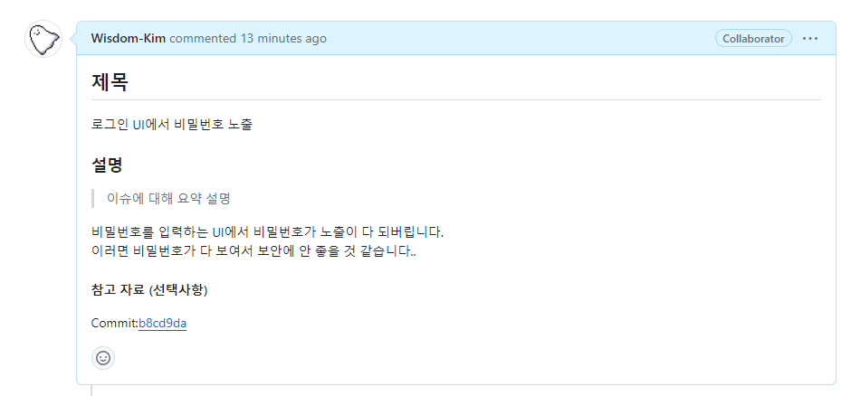

# 커밋 시 이슈를 참조하여 Close하는 법

레포에 올라온 이슈를 해결할 때, commit과 함께 이슈를 close하는 방법이 있습니다.

다음과 같이 누군가가 버그에 대해 이슈를 올렸을 때,

이슈를 해결하는 개발자가 commit시
commit message에 **"#[Issue Number]"**를 입력하는 경우, 자동으로 이슈에 커밋 내용을 추가하게 됩니다.

</img>
아까 올라온 이슈를 해결하기 위해, 커밋 메세지에 "#[4]"를 입력했습니다.
 

다시 이슈를 확인해보면 다음과같이 해당 번호의 이슈가 자동으로 close된 것을 확인할 수 있습니다.